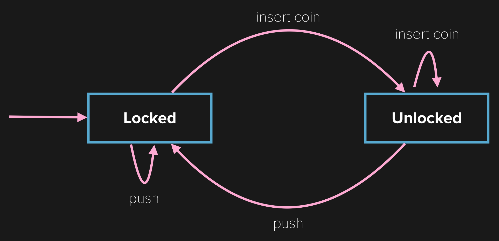
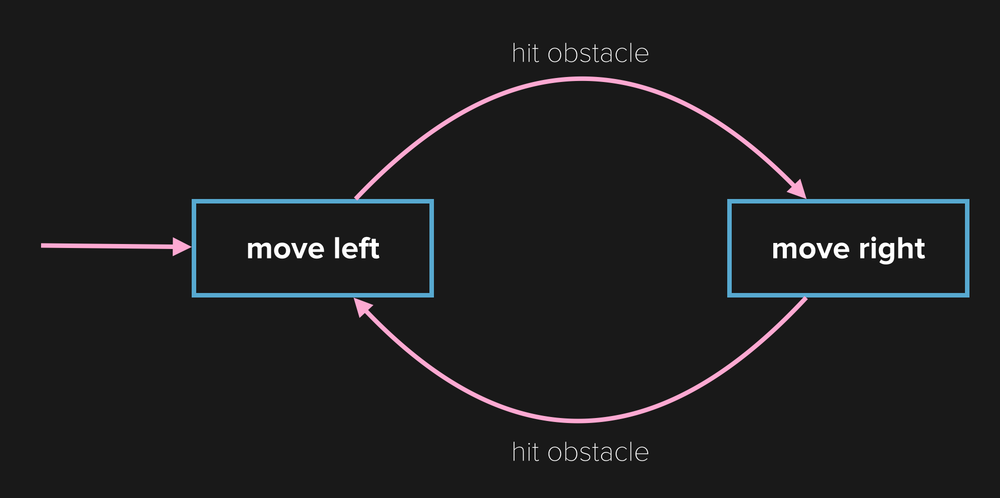

In this exercise, you'll learn a bit about basic artificial intelligence through a friendly competition. During *Robot Wars* you'll program the behavior of a virtual robot. Your robot will go head-to-head with other robots in the *Robot Wars Showdown*!

#An introduction to AI

Artificial intelligence (or AI) is what makes enemies in games move in meaningful ways. Developers program enemies to implements behaviors that make them seem as if they are thinking for themselves. These AIs can be as simple as those behind Goombas in old Mario games (move until they hit something, turn around and repeat the process) or as complex as those used in the game [Left 4 Dead](http://www.valvesoftware.com/publications/2009/ai_systems_of_l4d_mike_booth.pdf).

#Finite state machines

When programming simple AI, we can break down a character's responses into *states*. The character starts in a single state. It will continue operating in this state until a new event moves it to another state. This system of states is called a Finite State Machine or a state machine. State machines are used all the time, especially in game development. They are incredibly simple but also very powerful.

#Turnstile example

Before we look at some code samples, let's take a look at a real world example. A coin-operated turnstile can be modeled as a simple state machine with two states: *locked* and *unlocked*.

A turnstile starts in the *locked* state. The only thing that can move it to the *unlocked* state is inserting a coin (pushing on the turnstile will do nothing since it is locked). Once a coin is inserted, the turnstile moves to the *unlocked* state and will stay there until you push the turnstile (nomrally while passing through it). After it is pushed, the turnstile goes back to the *locked* state. The turnstile will continue moving through these two states forever but is still considered a *finite state machine* since there are a finite number of states (2) it can be in.

> [info]
> 
>
> The image above is a state machine diagram for a coin-operated turnstile. The rectangles represent the states while the arrows show the actions that can be performed to keep or change the current state.

#Basic Mario enemies

The movement of basic enemies in the early Mario games is even more simple than the turnstile example. Most enemies have two states: *move left* and *move right*. They stay in their state until hitting an obstacle. For some enemies this obstacle is a physical obstacle that the player can see. For others, this obstacle is an invisible sensor (similar to the goal sensors we used in Hoppy Bunny to trigger a score increase).

The state machine behind this basic AI can be diagramed like this:

