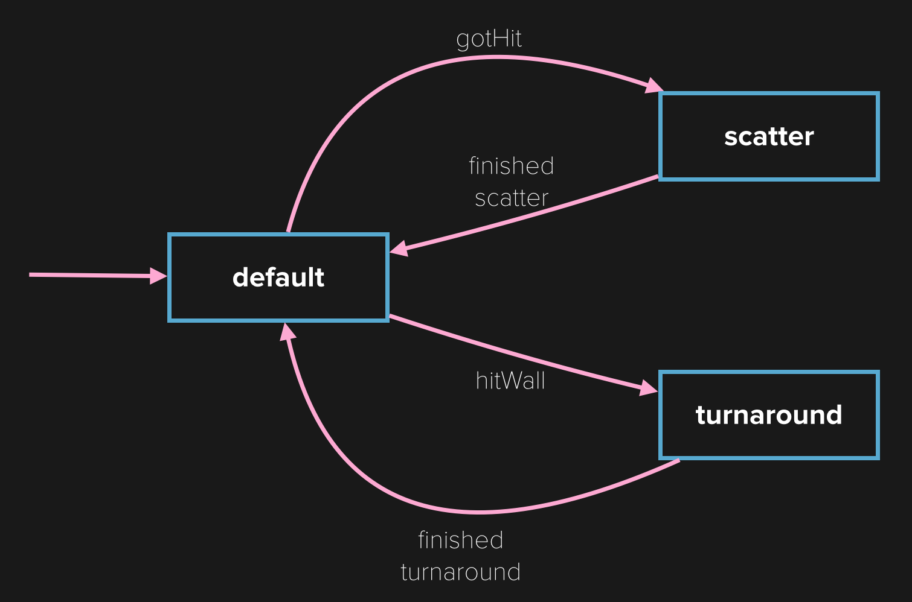
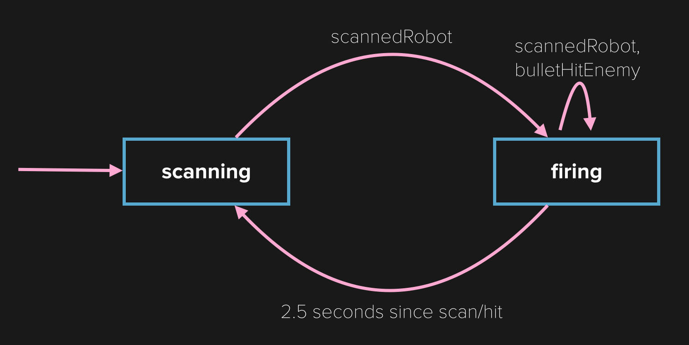
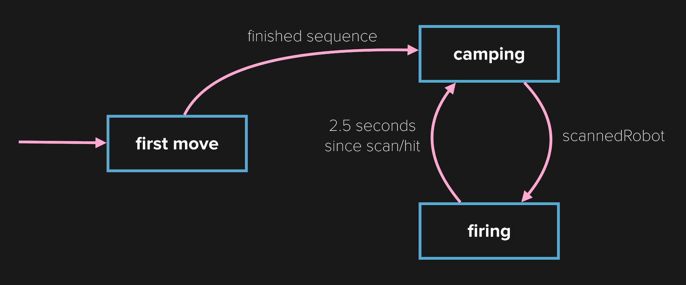
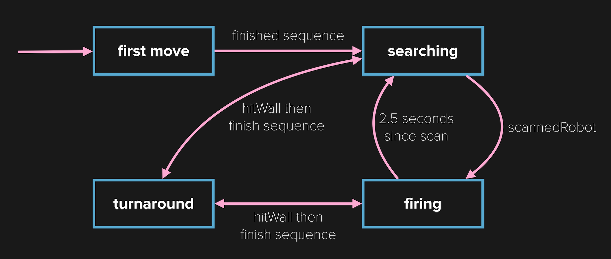

We have written a few sample robots to give you some ideas of how to set up your AI state machine and take advantage of different callbacks.

> [action]
> Open up RobotWar.xcodeproj (within RobotWar.spritebuilder).

There is a *Robots* folder containing a few sample robots. You can change which robot is competing by placing the Class name of the robot in "Configuration.h":

        static NSString \*robotClass1 = @"RobotOneClassName";
        static NSString \*robotClass2 = @"RobotTwoClassName";

It's a good idea to check out each robot's AI in action by watching a few games between it and other robots.

#SimpleRobot

All Robots inherit from the "Robot" class and implement the callback methods we discussed earlier.

Let's get started with SimpleRobot. Open up *SimpleRobot.swift*.

SimpleRobot implements the methods hitWall, run, and gotHit. The endless loop in run zigzags around and blindly shoots. hitWall gets called when it runs into a wall. SimpleRobot's response is to turn 180 degrees when it hits it's front and to turn 90 degrees in the opposite direction when it hits it's right or left sides. The gotHit callback invokes a knee jerk reaction of shooting, followed by a turn and move to navigate the robot out of the way of additional bullets.

While there are no explicit states used by SimpleRobot, we can see three states: default, scatter, and turnaround. The robot starts in the default state. It moves to the scatter state when getting hit then moves back to default after it shoots and moves. It enters the turnaround state when it hits a wall and moves back to the default state after turning and moving away from the wall.

SimpleRobot's AI state machine diagram looks like this:

#TurretRobot

Open up *TurretRobot.swift*.

TurretRobot is even simpler than SimpleRobot but it's the first time we'll see the usage of explicit states. TurrentRobot defines two states as an enum called RobotState: scanning and firing. It starts off in the scanning state and continually rotates its gun right.

Once the enemy is scanned, it turns it's gun towards it and moves to the firing state. In the firing state it continues to shoot. When it scans or hits the enemy, the last known position is updated and the gun is turned towards it. After 2.5 seconds without a successful scan or bullet hit, TurretRobot moves back to the scanning state.

TurretRobot's AI state machine diagram looks like this:

#CamperRobot

Open up *CamperRobot.swift*.

CamperRobot defines three explicit states: first move, camping, and firing. It starts off in the first move state. During this state it moves to the nearest corner and then enters the camping state. In the camping state it turns the gun to the center of the battlefield and continues to shoot. If the enemy is scanned, it moves to a firing state similar to TurretRobot's. After 2.5 seconds without a successful scan or bullet hit, CamperRobot moves back to the camping state.

CamperRobot's AI state machine diagram looks like this:

#AdvancedRobot

Open up *AdvancedRobot.swift*.

Advanced robot defines four explicit states: default, turnaround, firing, and searching. It also makes use of an `actionIndex`. Using this `actionIndex` and switch statement pattern will allow your run loops to "short circuit". This is important because of how the robot's code is run. When you leave a callback, you go directly back to where you were in your `run` method. If you had a long sequence of actions, it would not check for a new state until you finished them. Performing a single move in each loop of `run` allows you to check and move onto the next state as quickly as possible.

AdvancedRobot starts off in the default state in which it charges ahead hoping to scan the enemy robot. From there it moves to the searching state. In searching it zig zags around until scanning the enemy or hitting a wall. When scanning the enemy it enters the firing state (similar to TurretRobot and CamperRobot). It leaves the firing state for searching after a timeout. When AdvancedRobot hits a wall, it enters the turnaround state to move away from the wall and then goes back to its previous state.

AdvancedRobot's AI state machine diagram looks like this:

